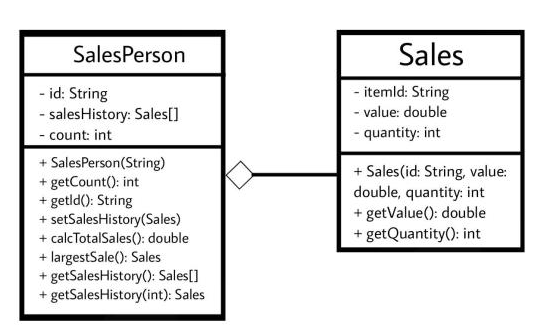

# Forum Activity: Class Design and Implementation Case - Session 9

## Number 1
### (a) By making use of an example from the above scenario, distinguish between a class and an instantiation of a class. (3 points)
A class is like a blueprint that describes how an object should be created. It defines what data the object will have and what actions it can perform.
An instantiation of a class is like an actual object created based on that blueprint. It is a specific instance that has its own unique data and can perform the actions defined in the class.
### (b) By giving two examples, explain how the principles of inheritance can be incorporated into the design of this administration program. (4 points)
Example 1: Employee Class
The Employee class can be the base class that represents common attributes and behaviors shared by all types of employees. It can include attributes like name, employee ID, and salary, as well as methods for calculating payroll and displaying employee information.
Example 2: Subclasses (Full-Time Employee and Part-Time Employee)
We can create subclasses that inherit from the Employee class to represent specific types of employees with additional attributes and behaviors.
### (c) Describe how the use of libraries can facilitate the development of programs like this company’s administration program. (3 points)
->Reusable Code: Libraries provide pre-built code that can be used in the administration program, saving time and effort by not having to write everything from scratch.
->Efficiency: Libraries simplify development by offering ready-to-use features, so developers can focus on specific tasks without worrying about the underlying complexities.
->Support and Updates: Libraries have a community of developers who maintain and improve them, providing updates, bug fixes, and assistance when needed. This ensures the program remains secure and up-to-date.

## Number 2
### (a) Complete the constructor public SalesPerson(String id), from the SalesPerson class. (2 points)
Done (Available in the code)
### (b) Explain why accessor methods are necessary for the SalesPerson class. (3 points)
Accessor methods are necessary for the SalesPerson class is because they provide a way to access the private instance variables. They allow controlled access to the instance variables and provide a level of abstraction and flexibility in how the data is accessed. 
### (c) (i) Construct unified modelling language (UML) diagrams to clearly show the relationship between the SalesPerson and Sales classes.

### (c) (ii) Outline a negative effect that a future change in the design of the Sales object might have on this suite of programs. (2 points)
Compatibility Issues: If the design of the Sales object changes, existing programs may not work correctly with the updated version. This can cause errors and require extensive modifications to make them compatible.
Integration Challenges: Changes in the Sales object's design can create problems when integrating with other components or classes. Dependencies may break, leading to unexpected results and requiring modifications in multiple parts of the programs.
### (d) State the output after running this code. (4 points)
102;
2;
2550.4;
5000;
### (e) Construct the method calcTotalSales(), in the SalesPerson class that calculates the total value of the sales for a specific SalesPerson object. (5 points)
Done (Available in the code)
### (f) By making use of any previously written methods, construct the method highest(), that returns the ID of the salesperson whose sales have the largest total value. (5 points)
Done (Available in the code)
### (g) Construct the method addSales(Sales s, String id), in the Driver class, that will add a new Sales object s, to the salesperson with a specified ID.
Done (Available in the code)
### (h) Suggest changes that must be made to the SalesPerson class and/or the Sales class to allow these calculations to be made. (3 points)
Additional Attribute in Sales class:
In the Sales class, an additional attribute can be added to store the sale amount. This attribute will allow the Payroll class to access and calculate the salesperson's salary based on the sale amount.
Enhanced Sales History in SalesPerson class:
In the SalesPerson class, the salesHistory array can be modified to include information about the sale amount. This modification allows the Payroll class to access the sales history and perform the necessary calculations.
Add a Method to Retrieve Monthly Sales in SalesPerson Class:
To retrieve sales made during a specific month for salary calculation, a method can be added to the SalesPerson class. This method will allow the Payroll class to access the sales made by the salesperson for a particular month.

### (i) Discuss the use of polymorphism that occurs in this suite of programs. (3 points)
Polymorphic Method Calls: Different types of salespeople can have their own versions of methods. The Payroll class can call these methods on different salesperson objects, and the appropriate implementation will be used based on the actual type of the object.
Polymorphic Arrays or Collections: Arrays or collections can hold objects of different salesperson subclasses, allowing for treating them uniformly and accessing their common methods and attributes through the base class.
Polymorphic Constructors: Different types of salesperson objects can be created using their respective constructors, but they can all be treated as instances of the base SalesPerson class.